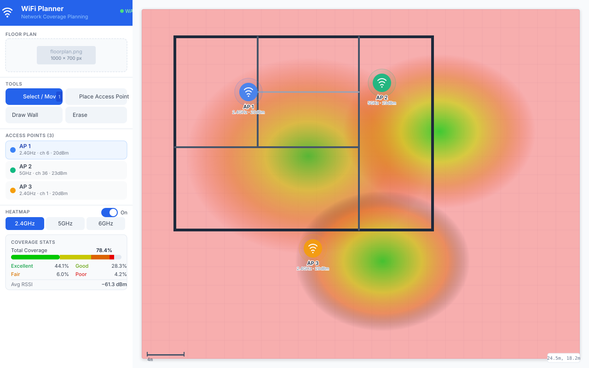
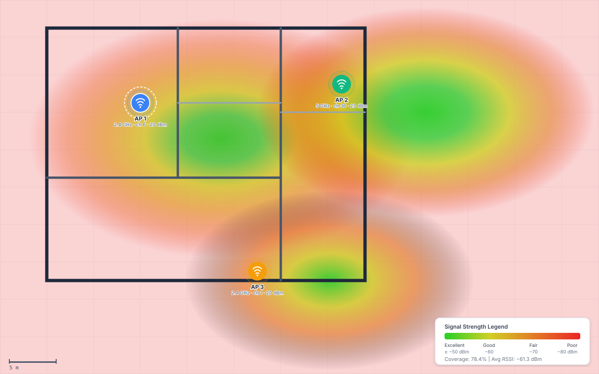
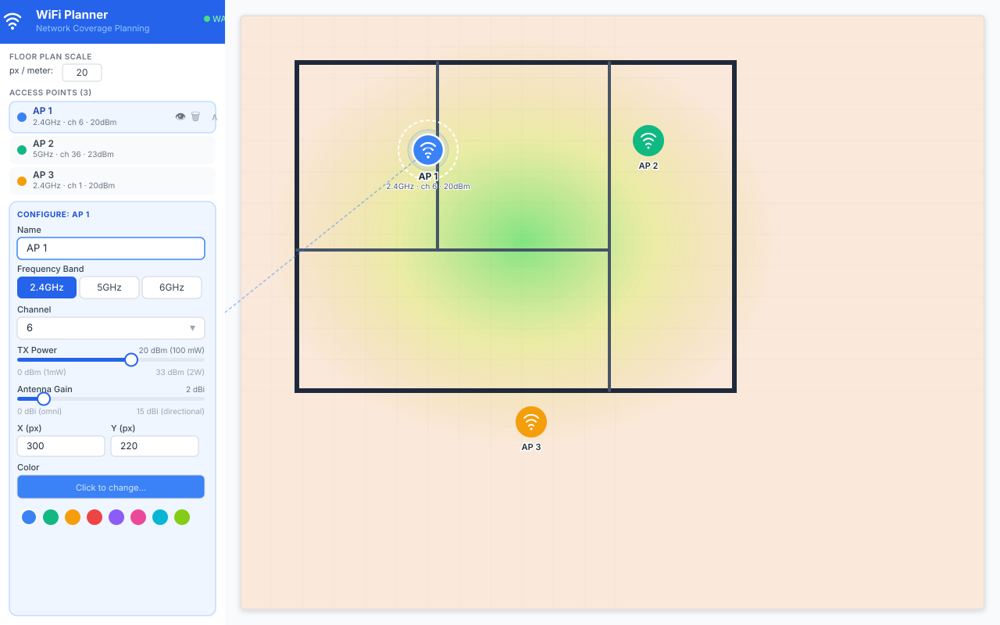
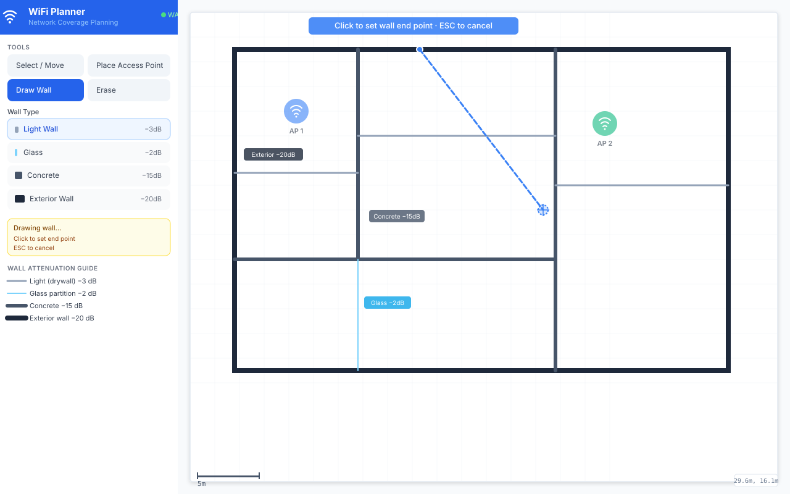
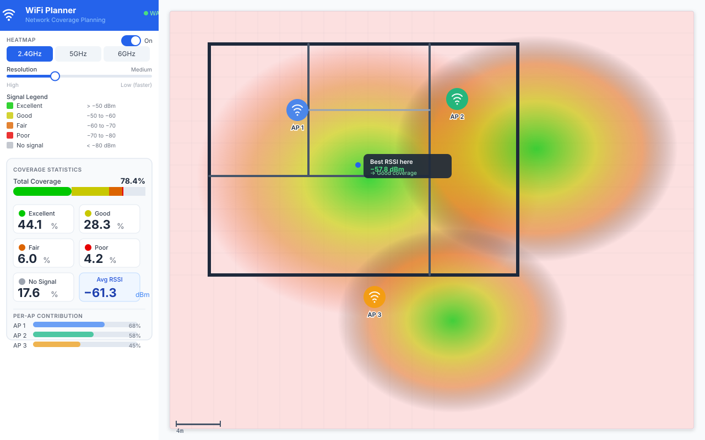

# WiFi Planner

A browser-based WiFi network coverage planning tool. Place access points on a floor plan, draw walls and obstacles, and see a real-time signal strength heatmap powered by a **Rust/WebAssembly** propagation engine.



---

## Features

| Feature | Detail |
|---------|--------|
| **Rust/WASM engine** | Signal propagation computed in WebAssembly (auto-loaded on page open) |
| **Real-time heatmap** | FSPL + wall attenuation model; updates as you place APs |
| **Multi-band support** | 2.4 GHz, 5 GHz, 6 GHz per AP |
| **Wall types** | Light (−3 dB), Glass (−2 dB), Concrete (−15 dB), Exterior (−20 dB) |
| **AP configuration** | Name, band, channel, TX power (0–33 dBm), antenna gain |
| **Floor plan upload** | PNG / JPG / SVG background image |
| **Coverage statistics** | Per-tier breakdown (Excellent / Good / Fair / Poor) + avg RSSI |
| **Built-in scenarios** | One-click residential + SMB floor plan templates |
| **Wall auto-detection** | Sobel edge detection extracts walls from uploaded images |
| **AP auto-deployment** | Greedy set-cover algorithm places APs for target coverage |
| **Multi-floor support** | Independent walls / APs / floor plan per floor with tab UI |
| **Export / Import** | Save and restore plans as JSON (v1.2 format with floors) |
| **Pan & Zoom** | Scroll to zoom, middle-click drag to pan |
| **Persistent state** | Plan auto-saved to `localStorage` |
| **Built-in web server** | Self-contained Rust HTTP/HTTPS server — no Node.js needed after build |

---

## Screenshots

| | |
|---|---|
|  |  |
| _Coverage heatmap across a multi-room floor plan_ | _Per-access-point configuration panel_ |
|  |  |
| _Wall drawing with selectable attenuation types_ | _Coverage statistics and signal legend_ |

---

## Prerequisites

| Tool | Version | Purpose |
|------|---------|---------|
| **Node.js** | ≥ 18 | JavaScript runtime + npm |
| **Rust** | ≥ 1.70 (stable) | Compile the WASM engine **and** the web server |
| **wasm-pack** | ≥ 0.12 | Build Rust → WebAssembly |

### Install Rust

```bash
curl --proto '=https' --tlsv1.2 -sSf https://sh.rustup.rs | sh
rustup target add wasm32-unknown-unknown
```

### Install wasm-pack

```bash
cargo install wasm-pack
# or
curl https://rustwasm.github.io/wasm-pack/installer/init.sh -sSf | sh
```

---

## Installation

```bash
# 1. Clone the repository
git clone https://github.com/godwinchang-code/WiFi-planner.git
cd WiFi-planner

# 2. Install JavaScript dependencies
npm install

# 3. Build the Rust/WASM engine
npm run build:wasm
```

The `build:wasm` step compiles `wasm-engine/` with wasm-pack and writes the
output to `src/wasm/pkg/`. The compiled `.wasm` binary (~32 KB) is also
committed to the repository so CI environments without Rust/wasm-pack can
skip this step.

---

## Running in Development

```bash
npm run dev
```

This rebuilds the WASM engine (if sources changed) then starts the Vite dev
server at `http://localhost:5173`.

The WASM engine is loaded automatically when the browser tab opens. A green
**WASM** badge in the top-left corner of the sidebar confirms it is active.

---

## Building for Production

```bash
npm run build        # compiles WASM + TypeScript, then bundles with Vite
npm run preview      # serve the dist/ folder locally (Node.js, dev only)
```

Output is written to `dist/`. The `.wasm` file is included as a hashed asset
by `vite-plugin-wasm` and served with the correct `application/wasm` MIME type.

---

## Built-in Web Server

After building the frontend, compile the self-contained Rust server which
**embeds `dist/` at compile time** — the result is a single binary with no
runtime dependencies (no Node.js, no nginx, no `dist/` folder needed alongside).

```bash
# 1. Build frontend → dist/
npm run build

# 2. Compile server (embeds dist/ into the binary)
npm run build:server
#    equivalent: cargo build --release --manifest-path server/Cargo.toml

# — or do both in one command —
npm run build:all
```

### Running the server

```bash
# Default: HTTP on 0.0.0.0:8080
./server/target/release/wifi-planner-server

# Custom host / port
./server/target/release/wifi-planner-server --host 127.0.0.1 --port 3000

# HTTPS with a PEM certificate and key
./server/target/release/wifi-planner-server \
  --tls-cert cert.pem --tls-key key.pem --tls-port 443

# Verbose logging
./server/target/release/wifi-planner-server --log-level debug
```

All options can also be set via environment variables:

| Env var | CLI flag | Default |
|---------|----------|---------|
| `WIFI_PLANNER_HOST` | `--host` | `0.0.0.0` |
| `WIFI_PLANNER_PORT` | `--port` | `8080` |
| `WIFI_PLANNER_TLS_PORT` | `--tls-port` | `8443` |
| `WIFI_PLANNER_TLS_CERT` | `--tls-cert` | — |
| `WIFI_PLANNER_TLS_KEY` | `--tls-key` | — |
| `WIFI_PLANNER_LOG` | `--log-level` | `info` |

### REST API

The server exposes a versioned API at `/api/v1/`:

| Method | Path | Description |
|--------|------|-------------|
| `GET` | `/api/v1/health` | Health / readiness check |

More endpoints (plan storage, settings) will be added in future iterations.

---

## Running Tests

### TypeScript / JavaScript tests (Vitest)

```bash
npm test              # run once
npm run test:watch    # watch mode
```

### Rust unit tests (native target)

```bash
npm run test:rust
# or directly:
cd wasm-engine && cargo test
```

### All tests

```bash
npm run test:all      # Rust (21 tests) + TS (56 tests)
```

Current totals: **77 tests, all passing**.

---

## Project Structure

```
WiFi-planner/
├── wasm-engine/                   # Rust crate → WebAssembly
│   ├── Cargo.toml
│   └── src/lib.rs                 # Propagation engine + unit tests
│
├── server/                        # Rust crate → self-contained web server
│   ├── Cargo.toml
│   ├── build.rs                   # Checks dist/ exists before embedding
│   └── src/
│       ├── main.rs                # Entry point: CLI → router → axum-server
│       ├── config.rs              # clap CLI + env-var configuration
│       ├── state.rs               # AppState (Arc'd, extensible)
│       └── api/
│           ├── mod.rs             # /api/v1 router
│           └── health.rs          # GET /api/v1/health
│
├── src/                           # React / TypeScript frontend
│   ├── main.tsx                   # App entry – mounts WasmProvider
│   ├── App.tsx
│   ├── wasm/
│   │   ├── engine.ts              # TypeScript wrapper around WASM functions
│   │   └── pkg/                   # wasm-pack output (committed)
│   ├── context/
│   │   └── WasmContext.tsx        # React context – auto-loads WASM on mount
│   ├── store/
│   │   └── plannerStore.ts        # Zustand store (floors, APs, walls, …)
│   ├── hooks/
│   │   ├── useHeatmap.ts          # Canvas heatmap (WASM → JS fallback)
│   │   └── useCanvasPan.ts        # Pan/zoom interactions
│   ├── data/
│   │   └── scenarios.ts           # Built-in floor plan templates
│   ├── components/
│   │   ├── Canvas/
│   │   │   ├── PlannerCanvas.tsx  # Main SVG canvas + event handling
│   │   │   ├── FloorTabs.tsx      # Multi-floor tab bar
│   │   │   ├── HeatmapLayer.tsx
│   │   │   ├── AccessPointMarker.tsx
│   │   │   ├── WallLayer.tsx
│   │   │   └── GridLayer.tsx
│   │   └── Sidebar/
│   │       ├── Sidebar.tsx
│   │       ├── ScenarioPanel.tsx  # Scenario selection
│   │       ├── AutoDeployPanel.tsx # AP auto-deployment
│   │       ├── Toolbar.tsx
│   │       ├── APPanel.tsx
│   │       ├── HeatmapSettings.tsx
│   │       ├── FloorPlanSettings.tsx
│   │       ├── ExportPanel.tsx
│   │       └── WasmBadge.tsx
│   ├── utils/
│   │   ├── signalSimulation.ts    # JS fallback propagation engine
│   │   ├── wallDetection.ts       # Sobel edge detection
│   │   ├── autoDeployment.ts      # Greedy set-cover AP placement
│   │   └── geometry.ts
│   ├── types/index.ts             # Shared TypeScript types
│   └── test/                      # Vitest test suite
│
├── docs/
│   ├── ARCHITECTURE.md
│   ├── SIGNAL_MODEL.md
│   └── screenshots/
│
├── package.json
├── vite.config.ts
└── tsconfig.json
```

---

## Keyboard Shortcuts

| Key | Action |
|-----|--------|
| `1` | Select / Move tool |
| `2` | Place Access Point |
| `3` | Draw Wall |
| `4` | Erase tool |
| `Delete` / `Backspace` | Remove selected AP or wall |
| `Esc` | Cancel wall drawing / reset to Select |
| Scroll wheel | Zoom in / out |
| Middle-click drag | Pan canvas |

---

## Design Documentation

- [Architecture overview](docs/ARCHITECTURE.md) – component hierarchy, WASM integration, state management
- [Signal propagation model](docs/SIGNAL_MODEL.md) – FSPL physics, wall attenuation, colour mapping

---

## License

MIT
